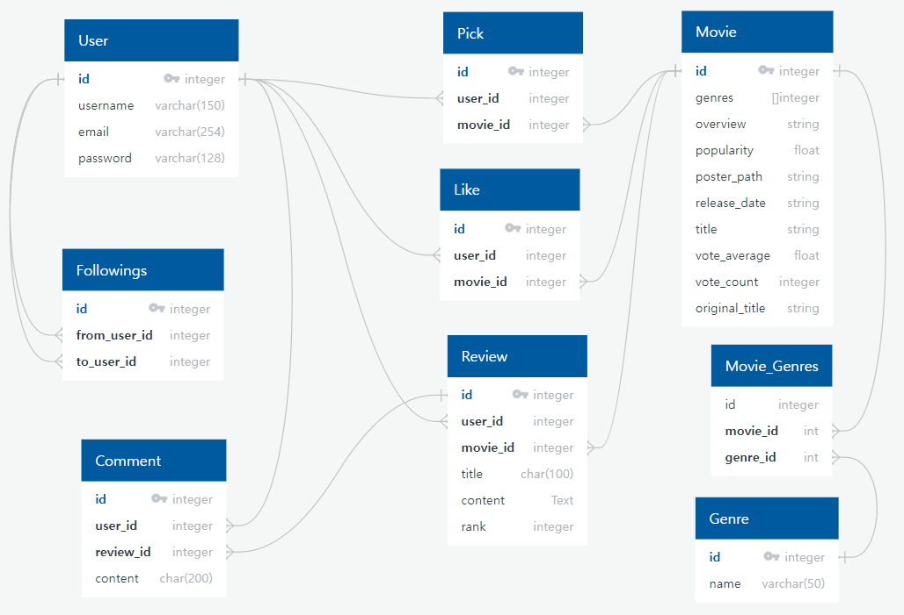
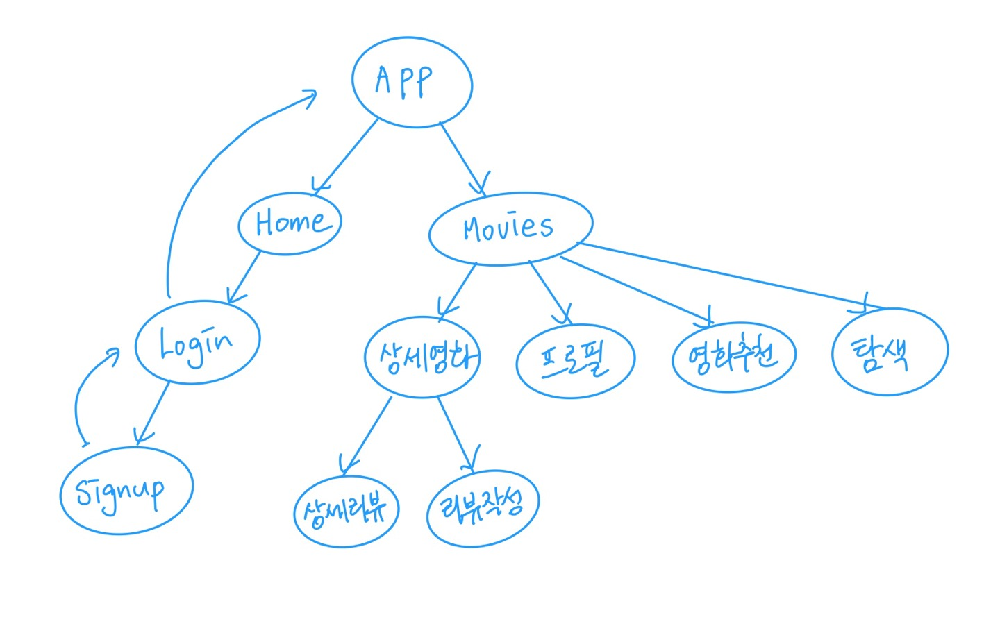
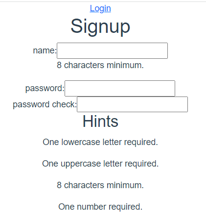
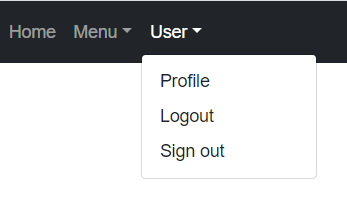

# 211117 README

팀장 : 윤성빈

팀원 : 상진수

### 1 환경설정 및 setting

#### db-erm



#### movie data

tmdb에서 data를 만들었습니다. (10000개)

```json
{ "model": "movies.genre", "pk": 37, "fields": { "name": "서부" } },
  {
    "model": "movies.movie",
    "fields": {
      "title": "베놈 2: 렛 데어 비 카니지",
      "release_date": "2021-09-30",
      "popularity": 4497.836,
      "vote_count": 1823,
      "vote_average": 6.8,
      "overview": "연쇄살인마 클리터스 캐서디(우디 해럴슨)가 사형선고를 받는다. 죽을 생각이 전혀 없는 클리터스는 자신의 집행일을 연기할 목적으로 마지막 증언을 남기겠다며 탐사보도로 유명한 프리랜스 저널리스트 에디를 지목한다. 베놈을 얻는 대신 직장과 연인을 모두 잃고 폐인처럼 생활하던 에디는 클리터스와의 단독 인터뷰를 통해 다시 한번 저널리스트로서 재기할 수 있는 기회를 얻는다. 클리터스가 던져주는 수많은 단서로 인해 미결로 남아 있던 살인사건을 추가로 밝히는 데 성공한 에디는 제일 먼저 앤에게 달려가지만 전편에서 에디의 몸에 베놈이 산다는 것을 알게 된 그녀는 새로운 연인 댄 박사(레이드 스콧)와 결혼을 선언한다. 평정심을 잃은 에디는 클리터스와의 인터뷰 중 실수로 클리터스가 새로운 빌런 카니지로 거듭나는 빌미를 제공하고 마는데...",
      "poster_path": "/1Lh9LER4xRQ3INFFi2dfS2hpRwv.jpg",
      "genres": [878, 28, 12],
      "original_title": "Venom: Let There Be Carnage"
    }
  },
```

### 2 회원가입 로그인 로그아웃



App.vue에서 로그인 했는지 안했는지 체크 한 후, 로그인 했으면 movies.vue를 띄우고 로그인 안 했으면 Home.vue를 띄운다. 

팀원과 같이 짠 컴포넌트구조에 따라 router를 만들었다.

### 4 sign form validator



### 5 router navigation guard 추가

네비게이션 가드는 사용자가 임의로 검색하여 비인증 상태에서 인증이 필요한 화면으로 넘어가는 것을 막아줍니다

비인증 사용자는 signup 페이지로 이동하게 됩니다

### 6 Navbar

vue bootstrap 를 이용해서 nav bar를 만들었다.

메뉴를 클릭해서 이동하거나, 기능을 구현하는 건 내일 할 예정이다.



