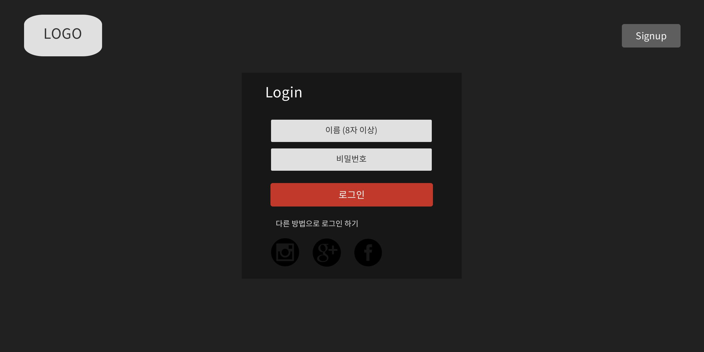
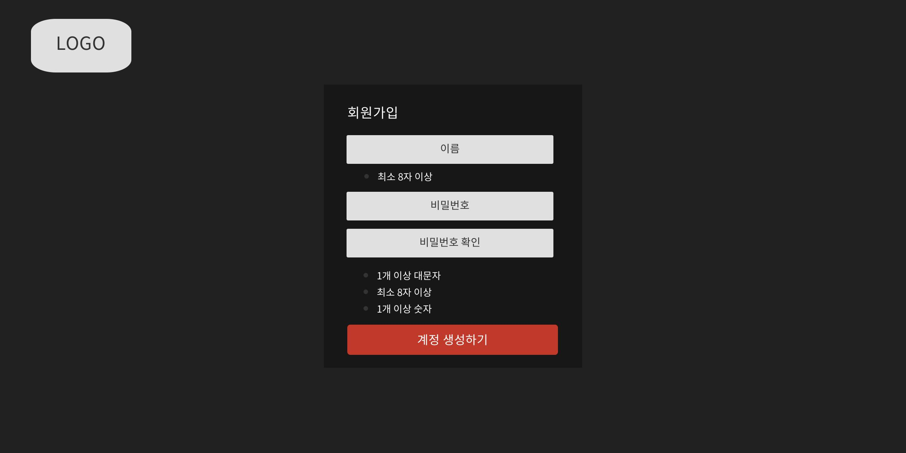
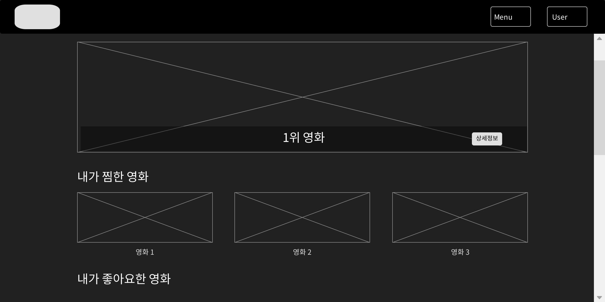

# 211118 READEME

### UI / UX 프로토타이핑

총 10page를 만들었다.

### Navbar

vue bootstrap에서 navbar를 따왔는데 원하는대로 작동하지않아서 조금 다르게 만들었다.

### search

분류 dropdown에서 장르를 선택하면 장르 별 인기영화 20개의 data를 뽑아준다. 분류창에서 선택하기 전 초기화면에서는 최신영화 20개를 뽑아준다.

dropdown도 장르가 많아 길어져서 스크롤 기능을 추가하였다.

그리고 분류창에서 dropdown으로 고르는 기능 외에 키보드로 직접 쳐서 장르를 선택할 수 있다.