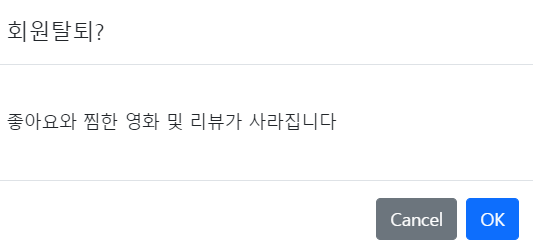
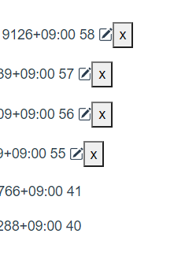

# 211122 README

### 추천알고리즘 2개

| User1이 작성한 review     |      |         |         |      |
| ------------------------- | ---- | ------- | ------- | ---- |
| movie_id                  | 4    | 5       | 2       | 1    |
| genres_pk                 | 1, 2 | 2, 5    | 1, 2, 5 | 2    |
| review_rank               | 7    | 2       | 4       | 7    |
| **User1이 like한 movies** |      |         |         |      |
| movie_id                  | 10   | 13      | 2       | 5    |
| genres_pk                 | 6, 7 | 4, 5, 6 | 1, 2, 5 | 2, 5 |

User1 에 대한 추천 알고리즘은 

User1이 작성한 review에서 점수 계산을 하고,

장르 1번 = (7 + 4) // 2 = 5.5점

장르 2번 = (7 + 2 + 4 + 7) // 4 = 5.25점

장르 5번 = (2 + 4) // 2 = 3 점

User1이 like한 movies에서 점수 계산을 한다.

장르 1번 = 1(번 들어있음) * 10점 = 10점

장르 2번 = 2 * 10점 = 20점

장르 5번 = 3 * 10점 = 30점

...

총 점수의 합은

장르 1번 = 15.5 점

장르 2번 = 25.25 점

장르 5번 = 33 점 으로 장르 5번의 점수가 가장 높다.

장르 5번의 영화를 popularity 순 + 최신 개봉한 순으로 영화를 추천해준다. 만약 장르들 중에 점수가 같은게 생긴다면, movie data에 있는 vote_average가 높은 순으로 정렬해서 추천해준다.

---

| User1의 like_movies | 1, 3              |
| ------------------- | ----------------- |
| User2의 like_movies | 3, 4, 5, 6        |
| User3의 like_movies | 1, 2, 3, 7, 9, 11 |

User1과 User2는 겹치는 영화가 1개 뿐이고, User1과 User3은 겹치는 영화가 2개이다.

User3과 like한 영화가 더 많이 겹치므로 User3의 영화 목록 중 User1이 like하지 않은 영화들을 추천해준다.

### 추천페이지

### searchbar 

영화제목 검색을 위한 검색창을 넣으려고 했으나 아직 미완성이다.

### 회원탈퇴

회원탈퇴를 누르면 알림창이 뜨고 ok를 누르면 axios 통신으로 로그아웃이 되면서 회원정보가 삭제된다.

그리고 signup 페이지로 넘어간다.

### 리뷰&댓글 update , delete

리뷰와 댓글들의 CRUD를 모두 만들었고, 추가적으로 본인이 작성한 리뷰와, 댓글들만 수정, 삭제 할 수 있는 기능을 넣었다.

