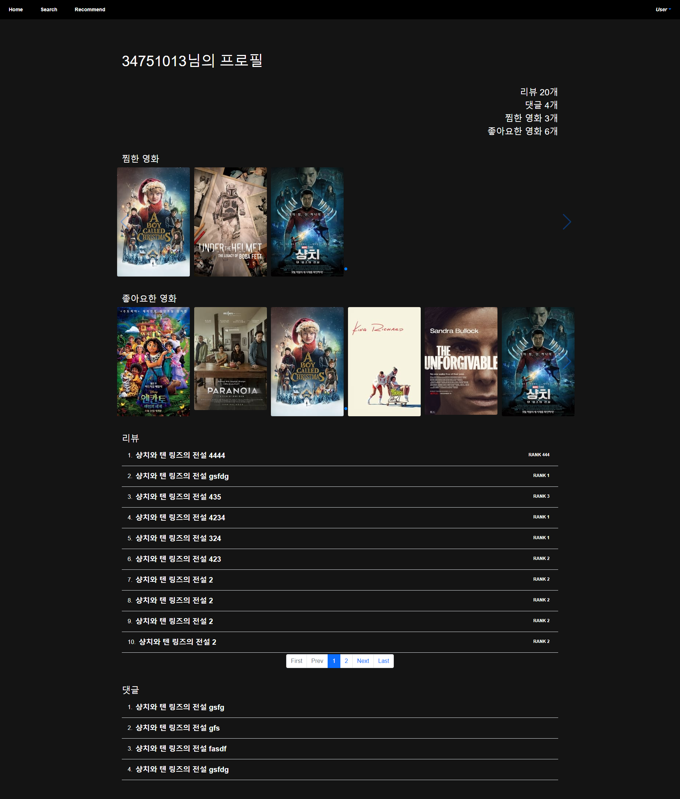

# 211123 README

어제까지 전체적인 기능은 모두 구현하였다. 오늘부터 남은 3일 간 CSS를 만들 계획이다.

CSS를 하면서 조금 부족한 기능도 보완할 것이다.

### 1.Home (로그인 전 홈페이지)

너무 밋밋해서 디자인을 어떻게 할 지 팀원과 회의를 하기로 했다.

### 2.Login

### 3.Signup

### 4.Movies (로그인 후 홈페이지)

navbar 수정, logo만들기, 영화 slide 애니메이션 효과를 추가 할 예정

### 5.Movie Item

### 6.Review Item

내일 할 예정

### 7.Recommend Movie

어제 만든 추천 알고리즘으로 추천 받은 영화를 표시해준다. 영화 포스터를 더블클릭하면 5.Movie Item 페이지로 넘어간다.

### Profile

### Search

너무 어두운 것 같아서 바탕화면이나 navbar, button 등의 색을 다시 적용 할 것이다.

