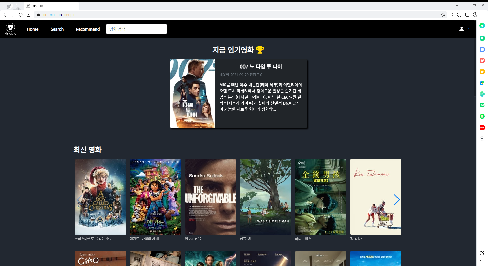

# KINOPIO

>키노피오는 평가데이터에 기반한 영화 평가/추천서비스를 제공하는 커뮤니티입니다.
>
>

### 프로젝트 기간

---

* 2021.11.17(수) - 2021.11.26(금)


### 기술 스택

---

* Front-end
  * vue : 4.5.15
  * npm : 8.1.0
  * Font Awesome
  * Bootstrap 4
* Back-end

### 핵심 기능

---

* Admin
  * 유저 관리 / 영화 등록 / 수정 / 삭제 권한
* 영화 정보
  * 7,000개 이상의 영화 데이터
  * 로그인 된 유저만 커뮤니티 이용 가능
* 추천 알고리즘
  * 리뷰 좋아요 기반 추천 알고리즘
  * 좋아요 유사 사용자 추천 알고리즘
  * 개발자 추천 알고리즘
* 커뮤니티
  * 로그인 한 유저만 리뷰&댓글 조회 / 생성
  * 작성자 본인만 수정 / 삭제
* 기타
  * 11개의 URL 및 페이지


### 팀원 및 역할 분담

---

* 상진수: 백엔드 설계 및 개발, 
* 윤성빈: 프론트엔드 설계 및 개발,


### installation

---

```python
$ pip install -r requirements.txt
```

```python
$ python manage.py migrate
$ python manage.py runserver
```

```vue
$ npm install
```

```vue
$ npm run server -- --port 3001
```


### web



---

<iframe src="https://drive.google.com/file/d/1Y0zHjhP0Lgr4D57ZjsczwoWaMdQtiZUe/preview" width="640" height="480" allow="autoplay"></iframe>
