# &#127916; KINOPIO <https://kinopio.pub>

>키노피오는 평가데이터에 기반한 영화 평가/추천서비스를 제공하는 커뮤니티입니다
>

## &#128197; 프로젝트 기간

* 2021.11.17(수) - 2021.11.26(금)

## :couple: 팀원 및 역할 분담

* 상진수: 백엔드 설계 및 개발, 영화 추천 알고리즘, 영화 검색 기능, vue navigation guard, 프로필, 서치, 추천, 로그인 전 페이지, 카카오 OAuth 로그인
* 윤성빈: 프론트엔드 설계 및 개발, 리뷰, 댓글 CRUD

## :wrench: 기술 스택

* Front-end
  * vue : 4.5.15
* Back-end
  * Django REST Framework

## :bulb: 핵심 기능

* Admin
  * 유저 관리 / 영화 등록 / 수정 / 삭제 권한
* 영화 정보
  * 7,000개 이상의 영화 데이터
  * 로그인 된 유저만 커뮤니티 이용 가능
* 추천 알고리즘
  * 리뷰 좋아요 기반 추천 알고리즘
  * 좋아요 유사 사용자 추천 알고리즘
  * 개발자 추천 알고리즘
* 커뮤니티
  * 로그인 한 유저만 리뷰&댓글 조회 / 생성
  * 작성자 본인만 수정 / 삭제
* 기타
  * 11개의 URL 및 페이지

## :computer: installation

* back

```python
$ pip install -r requirements.txt
```

```python
$ python manage.py migrate
$ python manage.py loaddata movies.json
$ python manage.py runserver
```

* front

```vue
$ npm install
```

```vue
$ npm run server -- --port 3001
```

## :sparkles: 와이어프레임

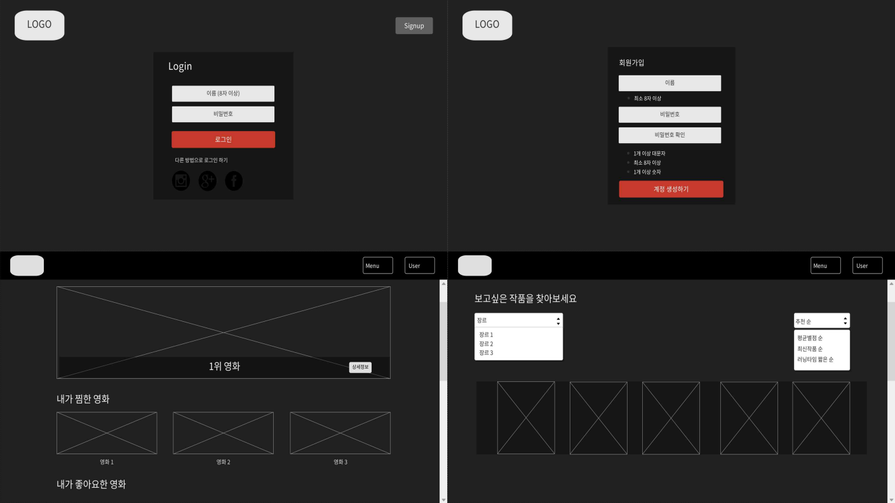

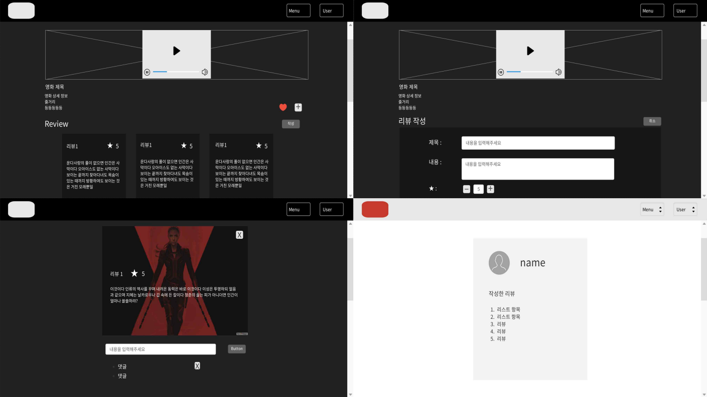

## :open_file_folder: Vue 프로젝트 구조

* accounts
  * 카카오인증로그인
  * 회원가입
    * 회원가입 시 유효성 검사
  * 로그인
    * 로그인 시 JWT Access 토큰 발행
  * 프로필
* community
  * 리뷰 CRUD
    * 댓글 CRUD
* movies
  * 영화 상세 정보
  * 추천 영화 
  * 영화 검색
  * 홈화면

## :mag_right: 기능 구현

### 로그인

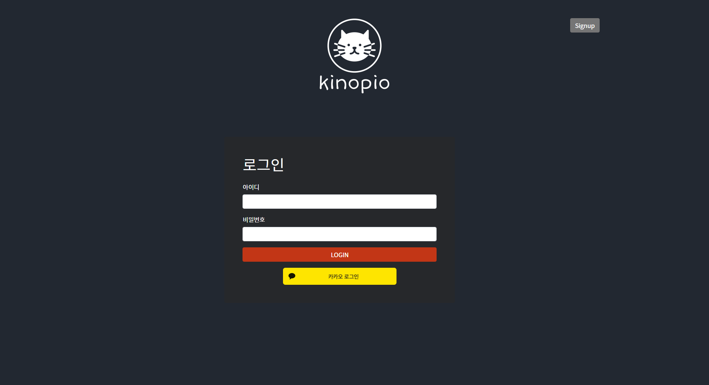

* 로그인을 한 인증된 사용자만이 키노피오 커뮤니티 사이트에 접속할 수 있습니다.
* REST API를 사용한 카카오 로그인은 인가 코드 받기, 토큰 받기의 두 단계를 거칩니다. 먼저 인가 코드를 받고, 그 인가 코드로 토큰을 요청해야 합니다.
* 인가 코드 요청 단계에서 클라이언트에 카카오계정 정보를 통해 사용자를 인증하는 과정을 거칩니다. 

### 회원가입

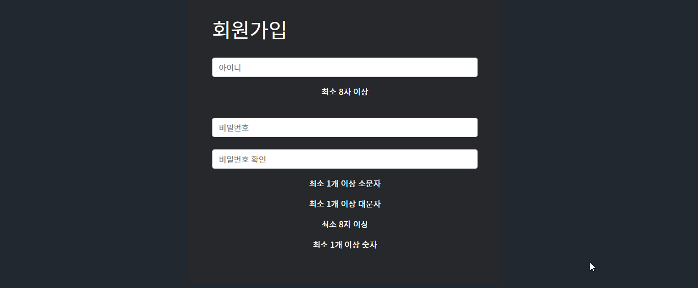

* 회원가입 유효성 검사를 통해 사용자가 회원가입 시 정보를 잘못 입력하는 경우를 막아줄 수 있습니다.

### 홈


* 지금 인기영화
  * 카드 슬라이더 형식으로 구성하여 자동으로 카드가 넘어가도록 구현했습니다.
* 최신 영화, 찜한 영화, 좋아요한 영화, 인기 영화
  * 각 테마에 맞는 영화 데이터를 뽑아 포스터와 제목을 보여주고 슬라이더 형식으로 나열해서 사용자가 직접 넘기면서 볼 수 있습니다.
  * 포스터 위에 마우스를 올리면 애니메이션 효과가 작동합니다.
  * 포스터를 더블클릭하면 해당 영화의 상세페이지로 넘어갑니다.

### 영화 검색

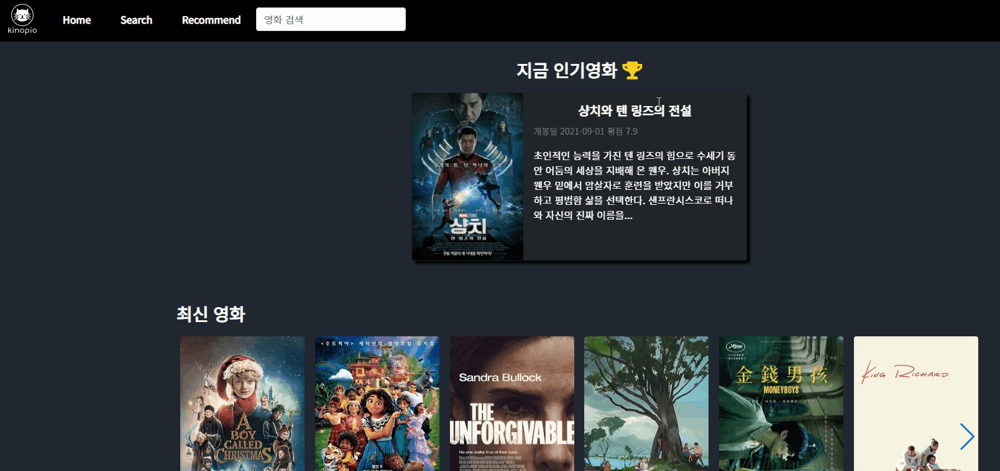

* 영화 제목을 입력하면 DB에 저장되어있는 'title' 과 동일한 영화의 상세페이지로 vue router 이동 합니다.

### 영화 상세 페이지

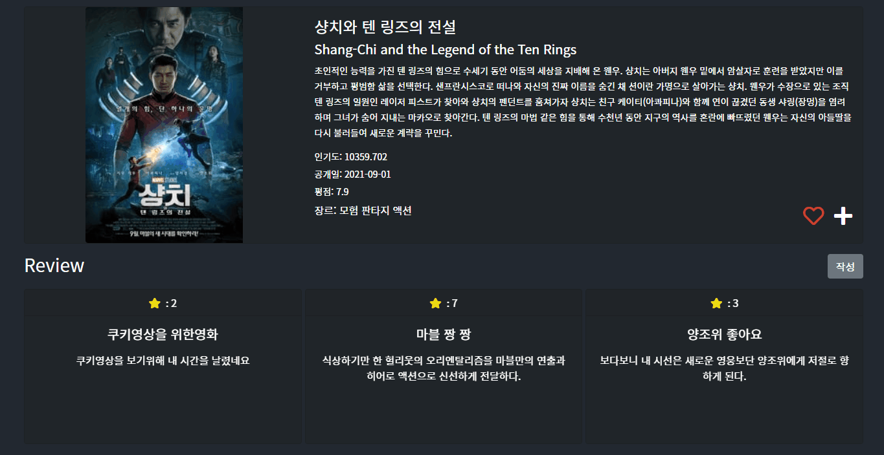

* 좋아요와 찜하기 기능
* 영화 상세 정보 아래에 리뷰리스트를 넣었고 사용자가 직접 넘기면서 볼 수 있습니다.
* 작성 버튼을 누르면 리뷰리스트와 리뷰작성폼이 토글형식으로 바뀌어 나타납니다.

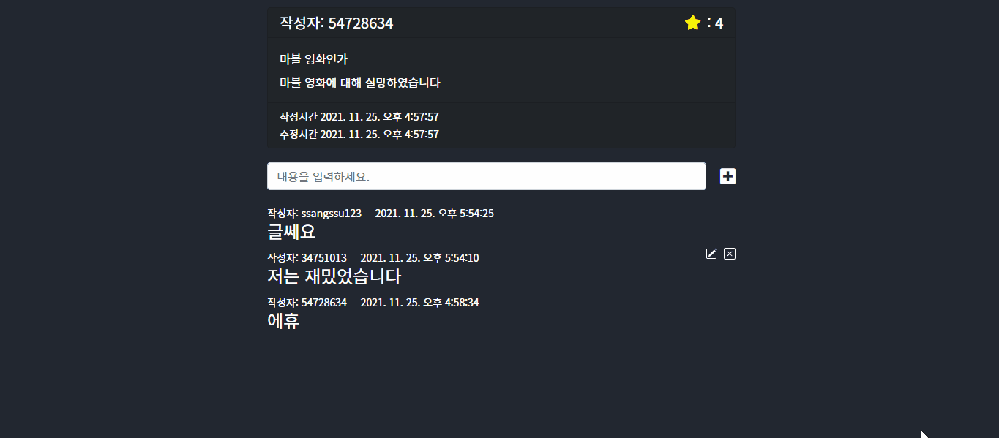

* 리뷰와 댓글 모두 작성자 본인만 수정, 삭제할 수 있습니다.

### 영화추천

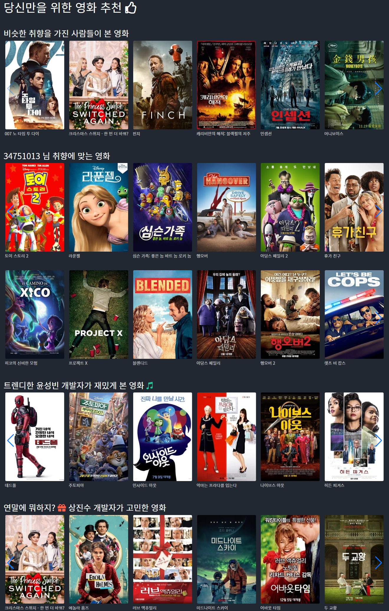

* 1번 라인
  * 좋아요 유사 사용자 추천 알고리즘으로 추천된 영화 리스트
* 2~3번 라인
  * 리뷰 좋아요 기반 추천 알고리즘으로 추천된 영화 리스트
* 4~5번 라인
  * 개발자 추천 알고리즘으로 추천된 영화 리스트
* 모든 영화 리스트는 슬라이더 형식으로 사용자가 직접 넘기면서 볼 수 있습니다.
* 포스터를 더블 클릭하면 해당 영화 상세페이지로 넘어갑니다.

### 영화 탐색


* 검색할 장르를 고르기 전에는 인기있는 영화 리스트를 보여줍니다.
* select 창으로 장르를 고를 수도 있고,  직접 원하는 장르를 입력해서 검색할 수도 있습니다.
* 장르를 검색하면 애니메이션 효과로 해당 장르의 영화 리스트들이 나타납니다.

### 프로필

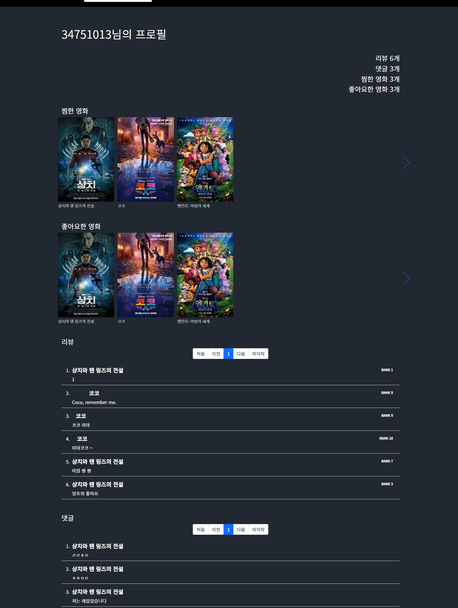

* 찜한 영화, 좋아요한 영화, 작성한 리뷰와 댓글들을 볼 수 있습니다.
* 작성한 리뷰와 댓글이 많아지면 페이지네이션으로 이동할 수 있습니다.

### 회원탈퇴

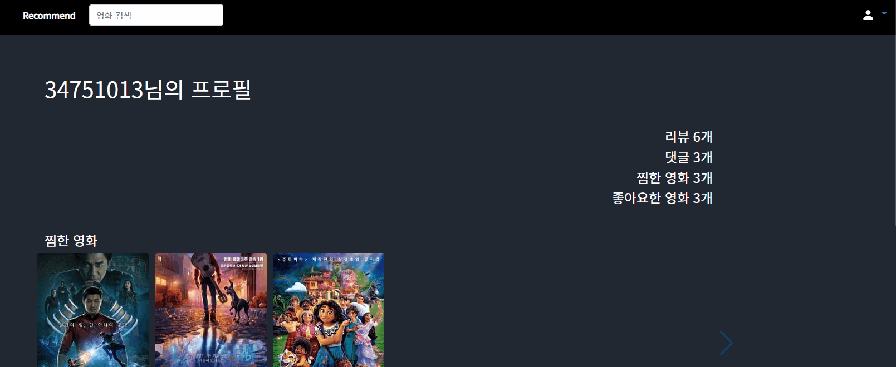

* 회원탈퇴를 누르면 경고문구가 alert로 나타납니다.

## :pencil2: 그 외 추가기능

### 안전장치

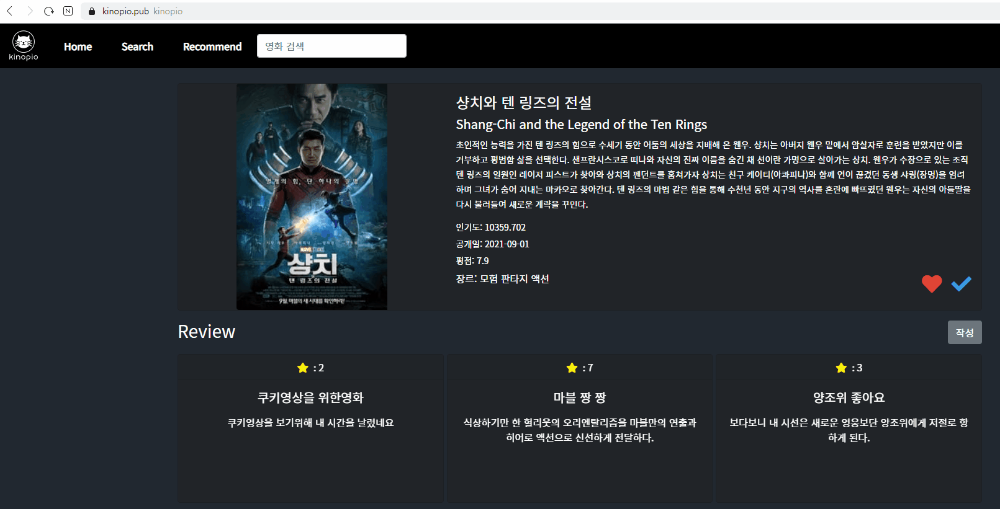

* 존재하지 않는 url를 입력할 경우 메인페이지로 이동합니다.
* 로그인을 하지 않은 상태에서 커뮤니티 url로 강제 접속할 경우 로그인 페이지로 이동합니다.

## 보고서


[구글 드라이브](https://drive.google.com/file/d/1Y0zHjhP0Lgr4D57ZjsczwoWaMdQtiZUe/view?usp=sharing)

